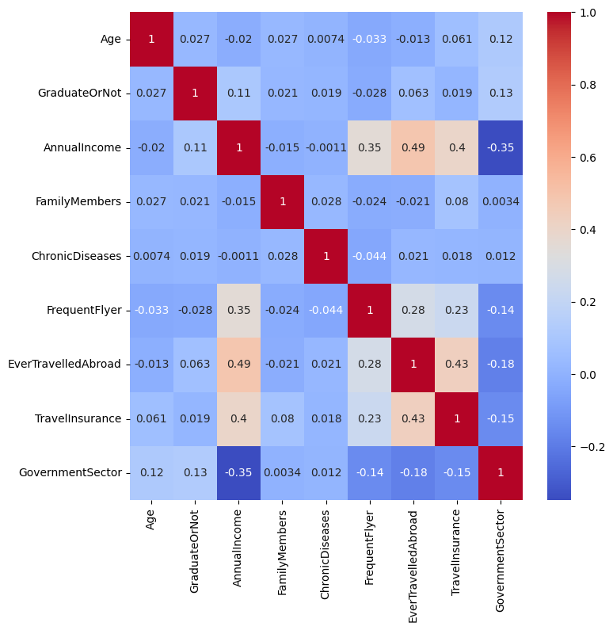
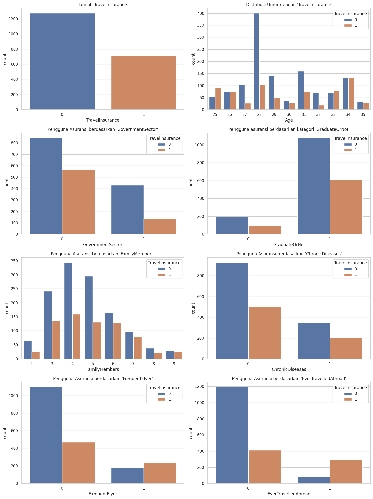
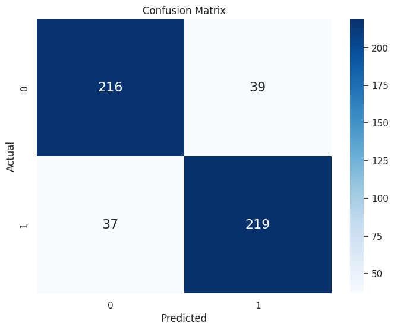

# Laporan Travel Insurance Predictive Analysis - Ardena Afif

## Domain Proyek

Proyek ini bertujuan untuk memprediksi pelanggan yang kemungkinan akan membeli asuransi perjalanan.

Latar belakang proyek ini timbul karena kebutuhan untuk mengidentifikasi calon pelanggan yang memiliki potensi untuk membeli asuransi perjalanan. Asuransi perjalanan memberikan perlindungan kepada individu yang bepergian, melindungi mereka dari berbagai risiko seperti sakit, keterlambatan pesawat, atau kejadian tak terduga lainnya yang mungkin terjadi selama perjalanan mereka, terutama yang berkaitan dengan kondisi rumah mereka yang ditinggalkan. [[1]](https://kc.umn.ac.id/13580/)

Hasil dari proyek ini akan berupa model _machine learning_ yang dapat berperan sebagai alat pendukung dalam pengambilan keputusan bagi perusahaan asuransi perjalanan. Hal ini menjadi relevan mengingat tren bisnis di bidang asuransi perjalanan diprediksi akan meningkat kembali setelah hampir mengalami kepunahan selama masa pandemi. Dengan pemulihan dalam industri penerbangan, asuransi perjalanan menjadi produk yang menarik bagi para pelancong, terutama mengingat risiko pandemi yang masih memerlukan waktu untuk kembali ke kondisi normal.

## Business Understanding

Perjalanan yang mencakup kunjungan ke lokasi tertentu dengan maksud tertentu telah menjadi kegiatan umum dan semakin dapat diakses oleh masyarakat luas dalam beberapa dekade terakhir. Penerbangan atau perjalanan udara kini menjadi bagian biasa dari mobilitas, memberikan kemudahan bagi banyak orang. Namun, perjalanan juga melibatkan risiko yang dapat mengganggu kenyamanan selama perjalanan dan setelah kembali ke tempat asal. Risiko-risiko ini, seperti kemungkinan sakit, kehilangan paspor, keterlambatan pesawat, atau masalah yang timbul di rumah yang ditinggalkan, menciptakan peluang bagi perusahaan asuransi perjalanan untuk menyediakan layanan perlindungan.

Perusahaan asuransi perjalanan perlu memiliki strategi pemasaran yang tepat untuk menawarkan jasanya kepada pelanggan potensial, sehingga upaya promosi dan pemasaran dapat dilakukan secara lebih efisien. Dalam rangka memenuhi kebutuhan tersebut, proyek ini bertujuan untuk mengembangkan model _machine learning_ yang dapat mengklasifikasikan pelanggan dalam konteks pembelian asuransi perjalanan.

### Problem Statements

Berdasarkan konteks yang telah dijelaskan, dapat dirumuskan permasalahan utama sebagai berikut:

1. Bagaimana melakukan pra-pemrosesan data asuransi perjalanan agar menghasilkan dataset yang optimal bagi model _machine learning_ dalam memprediksi keputusan pelanggan saat pembelian asuransi perjalanan?
2. Bagaimana merancang dan melatih model _machine learning_ yang dapat efektif memprediksi keputusan pelanggan dalam pembelian asuransi perjalanan, dengan mempertimbangkan akurasi model minimal sebesar 80%?

### Goals

Adapun tujuan dari proyek ini adalah:

1. Melakukan pra-pemrosesan data asuransi perjalanan untuk menghasilkan dataset yang sesuai standar bagi model _machine learning_.
2. Membangun model _machine learning_ yang dapat memprediksi keputusan pelanggan dengan tingkat akurasi setidaknya 85%.

### Solution Statements
Agar tujuan di atas dapat tercapai, langkah-langkah solusi yang diusulkan adalah sebagai berikut:

1. Pra-pemrosesan Data:

    - Melakukan pemilihan kolom fitur berdasarkan korelasi dengan kolom target. 
    - Memisahkan dataset menjadi data latih (80%) dan data uji (20%). 
    - Melakukan normalisasi data untuk memastikan skala data yang seragam.

2. Pembuatan Model:
   - Menggunakan algoritma _KNN_ (_K-Nearest Neighbors_) untuk menghasilkan model baseline. 
   - Mengimplementasikan algoritma _Gradient Boosting_ untuk model baseline sebagai perbandingan. 
   - Menyusun strategi pengembangan model dengan melakukan tuning pada hyperparameter guna meningkatkan akurasi.

Solusi di atas diarahkan untuk memastikan model dapat memenuhi tujuan akurasi yang telah ditetapkan.

## Data Understanding
Data yang digunakan dalam proyek ini diperoleh dari platform Kaggle dan diunggah oleh pengguna bernama TejasTheBard dengan judul [Travel Insurance Prediction Data](https://www.kaggle.com/tejashvi14/travel-insurance-prediction-data).

Berdasarkan informasi metadata, dataset ini berasal dari basis data perusahaan perjalanan di India. Dataset TravelInsurancePrediction.csv yang telah diunduh terdiri dari 10 kolom dengan deskripsi sebagai berikut:

`Unnamed 0` : Indeks atau nomor baris.

`Age` : Umur pelanggan.

`Employment Type` : Sektor pelanggan bekerja Pemerintah (Government Sector) atau Swasta (Private Sector/Self Employed').

`GraduateOrNot` : Status lulusan perguruan tinggi.

`AnnualIncome` : Pendapatan tahunan (Rupee).

`FamilyMembers` : Jumlah anggota keluarga.

`ChronicDiseases` : Status ada tidaknya penyakit kronis pelanggan (asma, diabetes, darah tinggi, dll).

`FrequentFlyer` : Status jika sering bepergian berdasarkan riwayat 2 tahun terakhir.

`EverTravelledAbroad`: Status bepergian ke luar negeri.

`TravelInsurance` : Status pelanggan membeli paket asuransi.

Visualisasi Korelasi antar varibel

Gambar 1. corelation-matrix

- ### Explanatory Data Analysis

  Menganalisis data menggunakan visualisasi

  
  
Gambar 2. Explanatory Data Analysis

  Hasil dari _Explanatory Data Analysis_:
    1. Pada distribusi umur dalam penggunaan TravelInsurance, bahwa umur dibawah 33 tahun cenderung tidak menggunakan Asuransi saat bepergian
    2. Pelanggan yang telah melakukan perjalan lebih dari 2 kali, cenderung menggunakan Asuransi
    3. Pelanggan yang sering bepergian keluar negeri juga menggunakan Asuransi Travel

## Data Preparation

  - ### Resampling dataset
    **Resampling dataset** untuk mencapai keseimbangan jumlah data. _Resampling_ diperlukan untuk mengatasi bias dalam prediksi akibat ketidakseimbangan kuantitas data. 
      
    - `label`: Kolom 'TravelInsurance' akan disimpan sebagai variabel target yang akan diprediksi. Dalam proyek ini, prediksi dilakukan terkait apakah asuransi perjalanan akan dibeli oleh pelanggan atau tidak. Oleh karena itu, 'TravelInsurance' menjadi label atau target yang ingin diprediksi.

    - `Features`: Menyimpan kolom-kolom yang akan digunakan sebagai fitur-fitur dalam model. Fitur-fitur ini adalah atribut-atribut yang diharapkan memiliki pengaruh terhadap keputusan pembelian asuransi perjalanan. Dalam hal ini, fiturnya mencakup informasi seperti usia pelanggan, status lulusan perguruan tinggi, pendapatan tahunan, jumlah anggota keluarga, status penyakit kronis, kebiasaan sering bepergian, riwayat bepergian ke luar negeri, dan sektor tempat pelanggan bekerja (pemerintah atau swasta).

    **Data sebelum di _Resampling_**
  
    Dataset memiliki ketidakseimbangan, di mana kelas 0 (tidak membeli asuransi perjalanan) memiliki 1277 data, sedangkan kelas 1 (membeli asuransi perjalanan) hanya memiliki 710 data.
  
    **Data setelah di _Resampling_**
  
    Setelah proses resampling dilakukan, khususnya untuk menangani ketidakseimbangan di kelas 1, data resampling dilakukan dengan mengambil ulang data pada kelas 1 sehingga jumlahnya menjadi seimbang dengan kelas 0. Dalam hal ini, data pada kelas 1 diambil ulang (resample) sebanyak 1277 data, sehingga jumlahnya menjadi sama dengan kelas 0. 

    Dataset baru menjadi seimbang, dimana kelas 0 dan kelas 1 masing-masing memiliki 1277 data. Hal ini dapat membantu meningkatkan keseimbangan kelas dalam model machine learning, terutama ketika melakukan pelatihan pada dataset yang awalnya tidak seimbang. 

- ### Membagi dataset

  **Membagi dataset** menjadi dua bagian, yaitu data latih sebesar 80% dan data uji sebesar 20%. Pembagian dataset penting untuk menguji performa model terlatih pada data baru. Dalam kasus dataset ini, rasio 80:20 dianggap optimal karena jumlah datanya masih dalam skala ribuan (1987 baris).  Pemilihan train_test_split dilakukan karena metode ini secara acak membagi dataset menjadi dua subset yang bersifat independen, yang dapat memberikan gambaran yang lebih baik tentang seberapa baik model akan berperforma pada data yang belum pernah dilihat sebelumnya.

- ### Normalisasi Data
  **Normalisasi** dengan mengubah skala data sehingga memiliki distribusi yang relatif seragam atau mendekati distribusi normal. Langkah standarisasi bertujuan untuk membuat fitur numerik memiliki skala yang seragam, memudahkan proses pelatihan model.

## Modeling

Sebagaimana disebutkan dalam pernyataan solusi, proyek ini menggunakan dua model _machine learning_ untuk menangani permasalahan yang dihadapi, yaitu _KNN_ dan _Gradient Boosting_.

- **KNN**: Model ini akan dilatih dengan menggunakan data yang telah melewati proses _pre-processing_. Selanjutnya, pengembangan model _KNN_ akan dilakukan dengan menerapkan _GridSearchCV_ untuk mencari kombinasi _hyperparameter_ terbaik. _GridSearchCV_ secara sistematis akan mengevaluasi performa model dengan mencoba berbagai kombinasi _hyperparameter_ yang telah ditentukan sebelumnya. Proses ini dilakukan dengan membagi dataset menjadi beberapa lipatan (_folds_) dan menguji model pada setiap kombinasi _hyperparameter_ di setiap lipatan. Dengan demikian, _GridSearchCV_ membantu menemukan kombinasi _hyperparameter_ yang memberikan performa terbaik untuk model _KNN_, yang dapat meningkatkan akurasi prediksi pada data uji.

  - Parameter terbaik untuk _KNN_ = `KNeighborsClassifier(algorithm='ball_tree', n_neighbors=7, p=1,
    weights='distance')`

  Hasil dari pelatihan dan pengujian model sebagai berikut:

  |                | Latih	                       | Test      |
  |------------------------------|-------------|-----------|
  | _KNN_	           | 0.845815	                    | 0.782779  |
  | _KNN_ Improved   | 0.92511	                     | 0.81409   |
  Tabel 1. KNN Model
    

- **Gradient Boosting**: Model _Gradient Boosting_ juga akan menggunakan modul sklearn dengan GradientBoostingClassifier, dan akan dilatih dengan data yang telah melewati tahap pra-pemrosesan. Seperti model _KNN_, proses pengembangan model Gradient Boosting akan memanfaatkan _GridSearchCV_ untuk mengidentifikasi kombinasi hyperparameter optimal.

    - Parameter terbaik untuk _Gradient Boosting_ = `GradientBoostingClassifier(max_depth=10, max_features='log2')`

    Hasil dari pelatihan dan pengujian model sebagai berikut:

    |                              | Latih	        | Test      |
    |------------------------------|----------------|-----------|
    | _Gradient Boosting_	           | 0.814488	    | 0.786693  |
    | _Gradient Boosting Improved_   |0.92511		    | 0.851272  |
  
  Tabel 2. Gradient Boosting Model

Dari hasil seluruh model yang dibuat, model _Gradient Boosting_ yang dikembangkan memiliki nilai terbaik, oleh karena itu model ini akan digunakan pada tahap selanjutnya.

## Evaluation

- ### Confusion Matrix
**Confusion Matrix** merupakan suatu tabel yang berisi empat notasi yaitu tp, tn, fp, fn. Notasi tp (true positive) dan tn (true negative) mencerminkan jumlah nilai positif dan negatif yang berhasil diprediksi dengan benar oleh model. Di sisi lain, notasi fp (false positive) dan fn (false negative) mengindikasikan jumlah nilai positif dan negatif yang diprediksi secara keliru oleh model. Meskipun matriks ini memberikan pemahaman yang relatif sederhana, namun kekurangannya terletak pada kurangnya informativitas untuk mengukur hasil secara mendalam, sehingga memerlukan analisis lebih lanjut.

 Gambar 5. Confusion Matrix 

- ### Evaluation Matrix

Metrik evaluasi model adalah ukuran yang digunakan untuk menilai kinerja suatu model _machine learning_.

1. **_Accuracy (Akurasi)_**

   **Accuracy** mengukur sejauh mana model dapat memprediksi dengan benar keseluruhan kelas, baik positif maupun negatif.
2. **_Precision_**

   **Presisi** mengukur sejauh mana prediksi positif model benar, dengan fokus pada seberapa akurat model dalam mengidentifikasi kelas positif.
3. **_Recall_**

   **Recall** mengukur sejauh mana model dapat menemukan atau mengenali instance dari kelas positif. Ini menyoroti kemampuan model untuk mendeteksi keseluruhan kelas positif.
4. **_F1-Score_**

    **F1-score** adalah rata-rata harmonik dari precision dan recall. Metrik ini memberikan keseimbangan antara presisi dan recall, dan bermanfaat ketika ada ketidakseimbangan antara kelas positif dan negatif.

## Analisis Hasil Proyek:

### Problem Statements Analysis:

  **Pra-pemrosesan Data**: Langkah-langkah pemilihan fitur dan normalisasi data telah dilakukan dengan baik untuk menghasilkan dataset yang optimal.

  **Pembuatan Model**: Penggunaan algoritma KNN dan Gradient Boosting sesuai dengan rencana dan pengembangan model melibatkan tuning hyperparameter.
  
### Goals Analysis:
  **Pra-pemrosesan Data**: Langkah-langkah pemilihan fitur dan normalisasi data telah dilakukan dengan baik untuk menghasilkan dataset yang sesuai standar.

  **Pembuatan Model**: Penggunaan algoritma KNN dan Gradient Boosting sesuai dengan rencana dan pengembangan model melibatkan tuning hyperparameter untuk meningkatkan akurasi.

### Evaluation Analysis:
- Akurasi (_Accuracy_): Menunjukkan sejauh mana model mampu mengklasifikasikan dengan benar berdasarkan keseluruhan dataset. Dalam konteks ini, nilai akurasi sebesar 85.1% menandakan bahwa model secara keseluruhan mampu memberikan prediksi yang benar sekitar 85.1% dari total data.

- Presisi (_Precision_): Menunjukkan seberapa baik model dapat mengidentifikasi kelas positif tanpa memberikan _false positive_. Dengan nilai presisi sebesar 85.5%, model cenderung memberikan prediksi yang benar saat memprediksi kelas positif.

- _Recall_: Juga dikenal sebagai sensitivitas atau true positive rate, mengukur sejauh mana model dapat mengidentifikasi semua instance kelas positif yang sebenarnya. Dengan nilai _recall_ sebesar 85.0%, model mampu menangkap sebagian besar instance kelas positif.

- _F1-score_: Menggabungkan presisi dan _recall_ menjadi satu metrik. Dengan nilai _F1-score_ sebesar 85.2%, model menunjukkan keseimbangan yang baik antara presisi dan _recall_.

**_Gradient Boosting_** dan **_KNN_** memiliki kinerja yang mirip. Namun, **_Gradient Boosting_** memiliki akurasi yang sedikit lebih tinggi. Oleh karena itu, **_Gradient Boosting_** dapat dikatakan sebagai algoritma yang terbaik.

## Kesimpulan

Proyek ini fokus pada pengembangan model _machine learning_ untuk memprediksi keputusan pembelian asuransi perjalanan. Menggunakan dataset dari Kaggle, langkah-langkah pra-pemrosesan data, pemilihan fitur, dan pembagian dataset dilakukan. Model _KNN_ dan _Gradient Boosting_ digunakan dengan proses pelatihan yang dioptimalkan menggunakan _GridSearchCV_. Evaluasi model melibatkan metrik confusion matrix dan sejumlah metrik akurasi lainnya. Dengan kombinasi strategi pra-pemrosesan dan model _machine learning_, proyek ini bertujuan mencapai tingkat akurasi prediksi 85%, yang penting untuk aplikasi bisnis dalam sektor asuransi perjalanan.

# External Resources

- Reference: 
    
  [[1]](https://kc.umn.ac.id/13580/) Astarie M. Setiawan, Yolanda (2020) *Perancangan Kampanye Sosial Penggunaan Asuransi Perjalanan Wisata*. Bachelor Thesis thesis, Universitas Multimedia Nusantara. [https://kc.umn.ac.id/13580/](https://kc.umn.ac.id/13580/)

- Dataset: [Kaggle: Travel Insurance Prediction Data](https://www.kaggle.com/tejashvi14/travel-insurance-prediction-data)